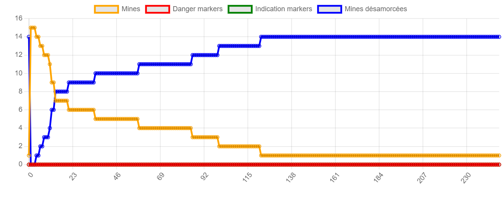
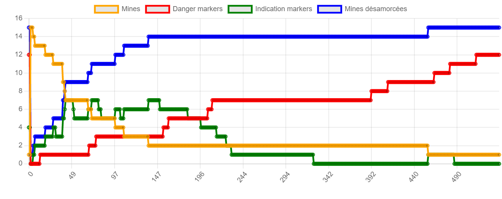
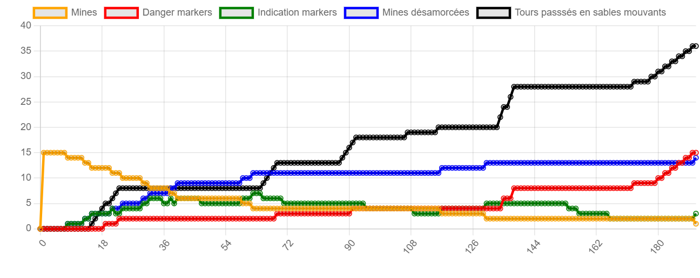

## Question 1
L'architecture de ce problème est la subsomption.

## Question 2
L'ordre des priorités 
Ici la priorité concerne les actions qui impliquent la modification de l'angle de déplacement.
Il faut que l'angle final choisi respecte les conditions prioritaires suivantes :
1-evite un autre robot
2-evite les bordures et les obstacles
3-se diriger vers une mine et la détruire
4-se déplacer,sable mouvant

Dans le code, je réalise les comportements de façon successive commençant par ceux de faible priorité par rapport à l'angle et terminant par celle de forte priorité. Ainsi la dernière modification de l'angle est faite par le comportement le plus prioritaire.
On peut ainsi faire le déplacement futur. 

Temps moyen de desamorçage des mines:
208.8

## Question 3
Simplicité : Perception → action
Modularité : n'est pas totalement respecté car il y'a des tâches ici qui implique plusieurs comportements. 
Ex : se diriger vers une mine et détruire une mine se regroupe en une seule tâche

## Question 4

L'introduction des balises apporte une sorte d'"intelligence collective". On a un comportement émergent, il y'a une sorte de communication indirecte entre les agents qui influence leur comportement. Les agents gardent leur caractère réactif en ayant des comportements basiques (sans reflexion) face à ces balises. 

## Question 5

Les comportements que l'on va ajouter avec la présence des balises sont des comportements qui modifient l'angle. Mais leur priorité est moindre comparé à celle d'autre comportement.
Nouvelle priorité :
1-evite un autre robot
2-evite les bordures et les obstacles
3-evite les balises dangers
4-se dirige vers les balises INFORMATION, les ramasse et 1/4 de tours
3-se dirige vers une mine, la détruire et ajoute une balise INDICATION
4-se déplace ,sable mouvant et ajoute une balise DANGER

## Question 6

Temps moyens : 221.6 

Le temps moyen de désamorçage des mines ne changent pas de façon sensibles. On peut observer une légère hausse. Cela s'explique par le fait que les agents ont plus de contraintes de mouvements. Souvent un agent doit contourner une balise avant de pouvoir déminer une mine. Cela prend plus de temps.

## Question 7

Les balises DANGER diminuent le temps moyen passés dans les sables mouvants. 

## Question bonus

